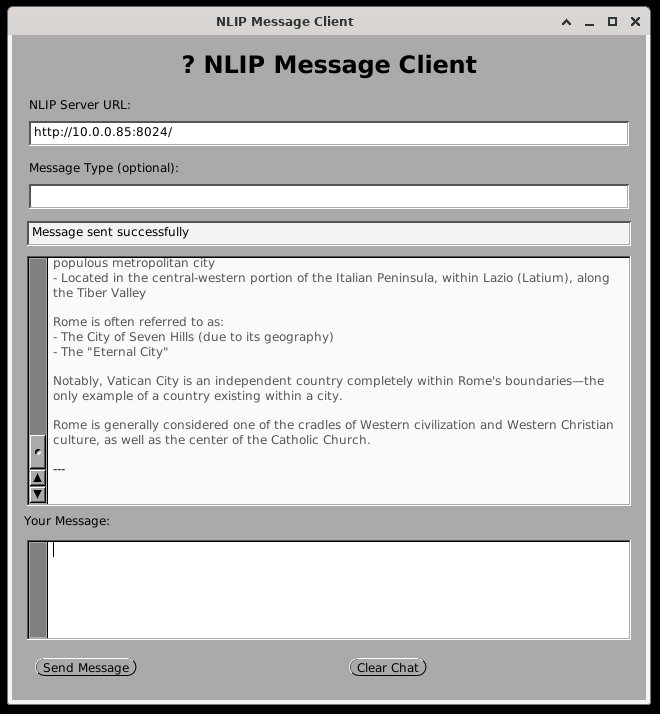

# NLIP Client - GNUstep Application

A native desktop application for sending and receiving NLIP messages, built with GNUstep/Objective-C.

## Features

- Native desktop application using GNUstep framework
- Send NLIP messages to a server
- Display received messages and submessages
- Clean, native UI with proper memory management
- Cross-platform (Linux, BSD, Windows with GNUstep)



## Prerequisites

### Linux (Debian/Ubuntu)
```bash
sudo apt-get install gnustep-devel gobjc
```

### Linux (Fedora/RHEL)
```bash
sudo dnf install gnustep-base-devel gnustep-gui-devel gcc-objc
```

### macOS
```bash
# GNUstep can be built from source or installed via homebrew
brew install gnustep-base gnustep-gui gnustep-make
```

### FreeBSD
```bash
pkg install gnustep-base gnustep-gui gnustep-make
```

## Building

1. Source the GNUstep environment:
```bash
source /usr/share/GNUstep/Makefiles/GNUstep.sh
# Or on some systems:
# . /usr/GNUstep/System/Library/Makefiles/GNUstep.sh
```

2. Build the application:
```bash
make
```

3. Install (optional):
```bash
make install
```

## Running

```bash
openapp ./NLIPClient.app
# Or directly:
./NLIPClient.app/NLIPClient
```

## Project Structure

- `main.m` - Application entry point
- `NLIPClientAppDelegate.h/m` - Application delegate, window management
- `NLIPClientController.h/m` - Main UI controller and logic
- `NLIPMessage.h/m` - NLIP message model with JSON serialization
- `GNUmakefile` - Build configuration
- `NLIPClientInfo.plist` - Application metadata

## Architecture

The application follows the Model-View-Controller (MVC) pattern:

### Model
- **NLIPMessage**: Represents NLIP message structure with JSON conversion

### View
- Native GNUstep UI components (NSTextField, NSTextView, NSButton, etc.)
- Programmatic UI layout (no NIB/XIB files needed)

### Controller
- **NLIPClientController**: Manages UI interactions and network communication
- **NLIPClientAppDelegate**: Application lifecycle management

## Key Features

### NLIP Message Support
- Creates properly formatted NLIP messages
- Parses NLIP responses
- Displays submessages in a structured format

### Network Communication
- Uses NSURLSession for HTTP requests
- Async request handling with completion handlers
- Proper error handling and user feedback

### UI Features
- Chat-like interface showing sent and received messages
- Status bar for connection feedback
- Clear button to reset conversation
- Scrollable message history
- Rich text formatting for different message types

## Memory Management

This application uses manual memory management (retain/release) following GNUstep conventions:
- All objects created with `alloc` or `new` are explicitly released
- Properties use `retain` attribute
- Autorelease used for return values
- Proper dealloc implementation in all classes

## Customization

### Changing the Default Server URL
Edit the initialization in `NLIPClientController.m`:
```objc
serverUrl = [[NSString alloc] initWithString: @"http://your-server:port"];
```

### Styling
The UI is created programmatically. Modify the `createView` method in `NLIPClientController.m` to adjust:
- Window size and layout
- Fonts and colors
- Component positioning

## Troubleshooting

### "Cannot find GNUstep.sh"
Make sure GNUstep is properly installed and source the environment script.

### Build errors about missing headers
Ensure gnustep-base-devel and gnustep-gui-devel are installed.

### Runtime errors
Check that you've sourced the GNUstep environment in the same shell where you run the app.

## Comparison to Web Version

| Feature | Web App | GNUstep App |
|---------|---------|-------------|
| Platform | Browser | Native Desktop |
| Size | ~50KB | ~100-200KB |
| Dependencies | Modern browser | GNUstep runtime |
| UI Framework | HTML/CSS/JS | AppKit/GNUstep |
| Performance | Good | Excellent |
| System Integration | Limited | Full |
| Offline Use | No | Yes |

## License

This is example code for demonstrating GNUstep application development.

## Further Reading

- [GNUstep Documentation](http://www.gnustep.org/resources/documentation.html)
- [OpenStep/Cocoa Programming Guide](https://www.gnustep.org/resources/OpenStepSpec/OpenStepSpec.html)
- [NSURLSession Documentation](https://developer.apple.com/documentation/foundation/nsurlsession)


## Note about the Coding of this Project

This project was largely written by Claude using Goose and VSCode.  An initial NLIP chat app had already been designed and run as a web-app in a browser.  I asked Claude via Goose to rewrite it as a GNUstep application.  There were a couple of details to work out.

- wanted flex sizing and suggested using GSTable
- needed to debug Cookie handling in NSURLSession (there may be a bug upstream in NSHTTPCookie.m where "Set-Cookie" is compared in a case-sensitive manner)
- Claude added debugging statements to help chase down the cookie problem
- there were a few remaining issues around the content resizing with window resizing but between myself and Claude we got these straightened out

Initial check-in with these features.  Built on Debian-13 with a fresh install of all GS components and it works fine.

ToDo:

- ENTER the string on RETURN, enter a newline on SHIFT-RETURN.
- fix up highlighting of multiple parts to be prettier
- use this app as a test case to investigate programming in Goose
